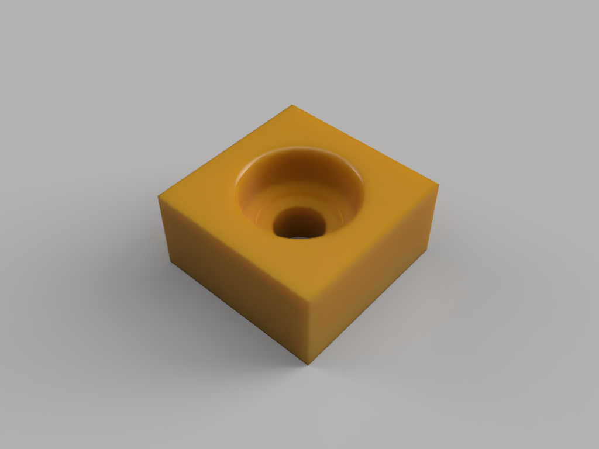

# 3DPrinting
Notes and files from my 3D Printing adventure

# Current plan May 18, 2021

My idea for project is to use 3D printing as a way to locate and bind
together stronger materials as needed.  For example, one of my first 
robotics project is to create a motorized camera job.

https://www.youtube.com/watch?v=2rpTdpCd38w

# Cube with Bearing

This is a test print that accepts a 22mm outer diameter bearing (8mm inside).  The idea behind this is to design a print that will hold
a bearing for smooth rotation.

The bearing is designed with a 1mm radius fillet around the outer edge
to aid in insertion without the plastic caving in on itself during 
the process.  The bearing sits 1mm below the surface of the block.

The bearing sits on a ring that supports the outer ring of the bearing.  A second 1mm troth is cut to provide relief for the inner bearing.  Finally a through hole is cut for the shaft.

The outer ring is enlarged by 0.1 (Tol) to provide a tolarance for fitting the bearing into the hole.

The part is fully parameterized.